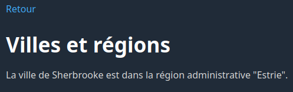
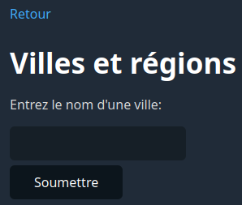
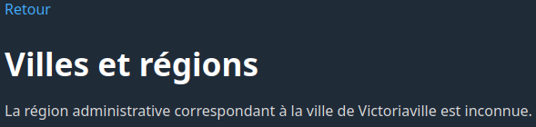
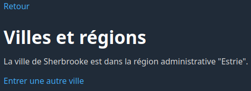
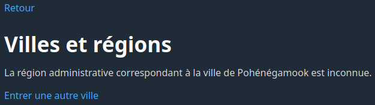

# Laboratoire 03-B

## Objectif

Vous familiariser avec la manipulation des tableaux associatifs, des données de formulaires et des variables de session.

## Prérequis

Clonez ce dépôt à la racine du répertoire contenant les fichiers Web de votre serveur Apache. Utilisez ensuite un navigateur Web pour accéder à l'adresse `/lab03b` sur votre serveur local.

Vous devriez voir une page avec le titre « Laboratoire 03-B ».

Ouvrez ensuite le dossier `lab03b` dans Visual Studio Code. Prenez connaissance des fichiers qu'il contient. Vous constaterez qu'il y a un fichier `index.php` (page d'accueil du laboratoire) et un sous-dossier `pages` contenant plusieurs autres fichiers PHP.

## 0 - Création du menu

TODO

## 1 - Villes et régions

### Étape 1.1

Dans le fichier `pages/villes_regions.php`, créez un tableau associatif contenant les données ci-dessous. Il s'agit d'un tableau qui associe des villes du Québec à leurs régions administratives.

| Clé              | Valeur           |
|------------------|------------------|
| Montréal         | Montréal         |
| Québec           | Québec           |
| Laval            | Laval            |
| Gatineau         | Outaouais        |
| Longueuil        | Montérégie       |
| Sherbrooke       | Estrie           |
| Magog            | Estrie           |
| Coaticook        | Estrie           |
| Trois-Rivières   | Mauricie         |
| Drummondville    | Centre-du-Québec |

Faites ensuite en sorte que la page reçoive un paramètre `ville` passé dans l'URL, et affiche la région administrative qui correspond à cette ville. Si le paramètre `ville` est absent, il faut afficher `Paramètre "ville" manquant.`. Si la ville est présente mais qu'elle ne se trouve pas dans le tableau, il faut afficher `Ville inconnue.`.

Voici le résultat attendu pour la valeur `Sherbrooke`:

### Étape 1.2

Modifiez votre page afin d'utiliser un formulaire pour indiquer le nom de la ville dont on veut connaître la région administrative. **L'information saisie ne doit pas être visible dans l'URL.** Vous devez respecter la logique décrite ci-dessous.

Si le champ `ville` n'a pas été reçu, il faut afficher le formulaire:

Si le champ `ville` a été reçu mais que cette ville ne se trouve pas dans le tableau, il faut afficher ceci:

Autrement, on affiche le résultat:

### Étape 1.3

Ajoutez un lien `Entrer une autre ville` qui ramène l'utilisateur au formulaire et qui s'affiche uniquement si le formulaire n'est pas présentement affiché.

## 2 - Page secrète

### Étape 2.1

Dans le fichier `pages/page_secrete.php`, faites en sorte que la page "Page secrète" demande un mot de passe pour accéder à son contenu. Le mot de passe doit être « **abricot** ». Si le mot de passe saisi est le bon, on affiche « **Bravo! Vous avez trouvé le mot de passe!** ». Sinon, on affiche « **Mot de passe incorrect.**

